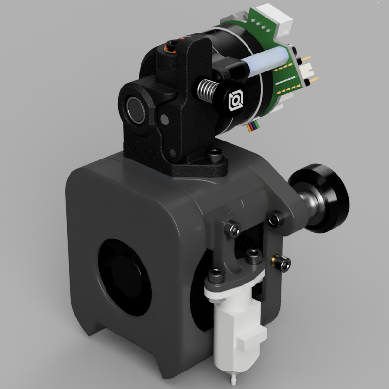
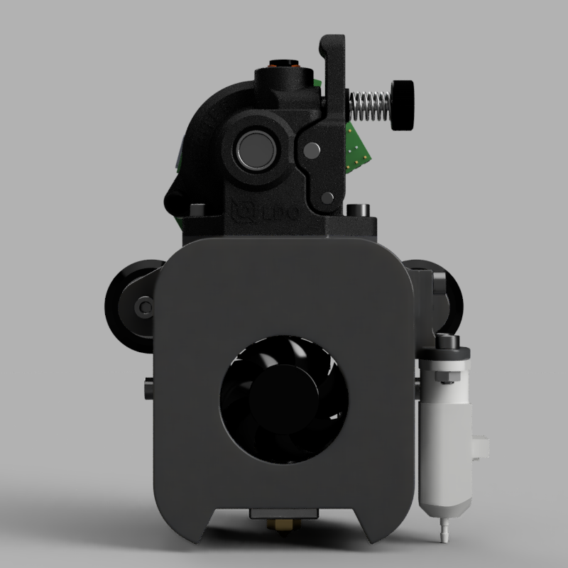
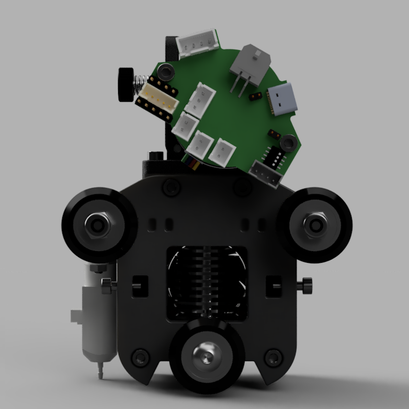
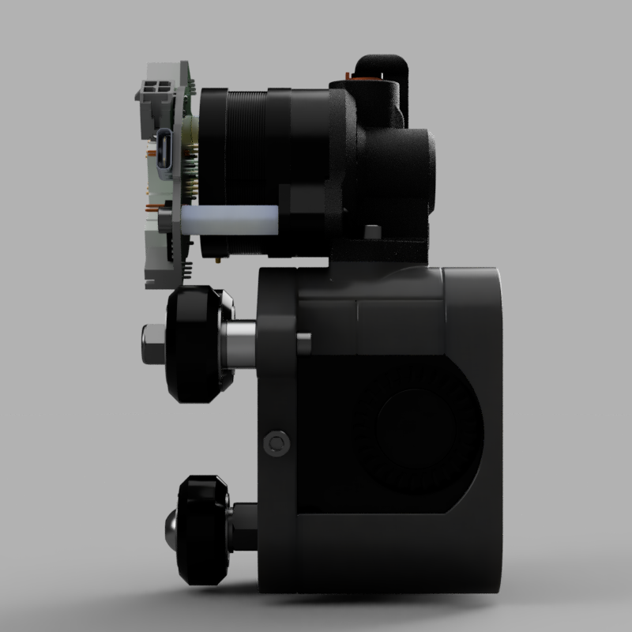
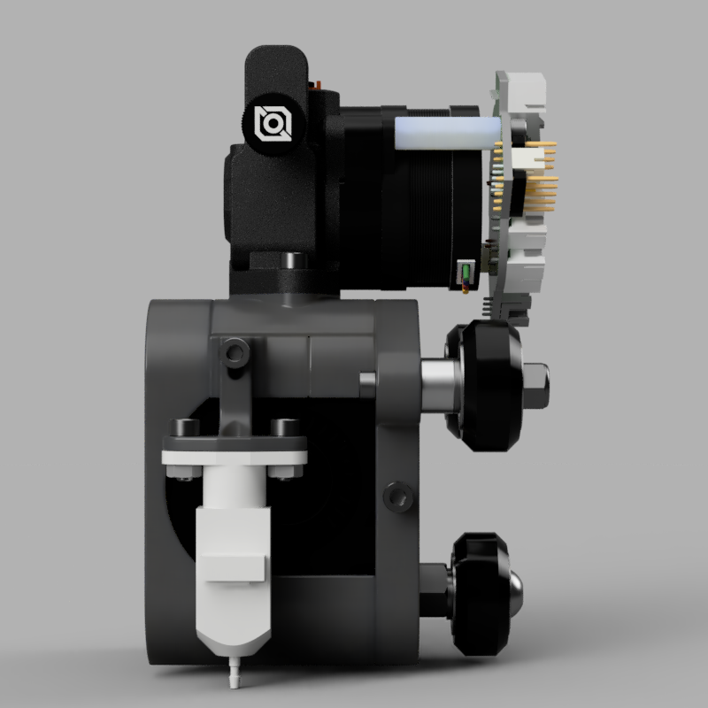
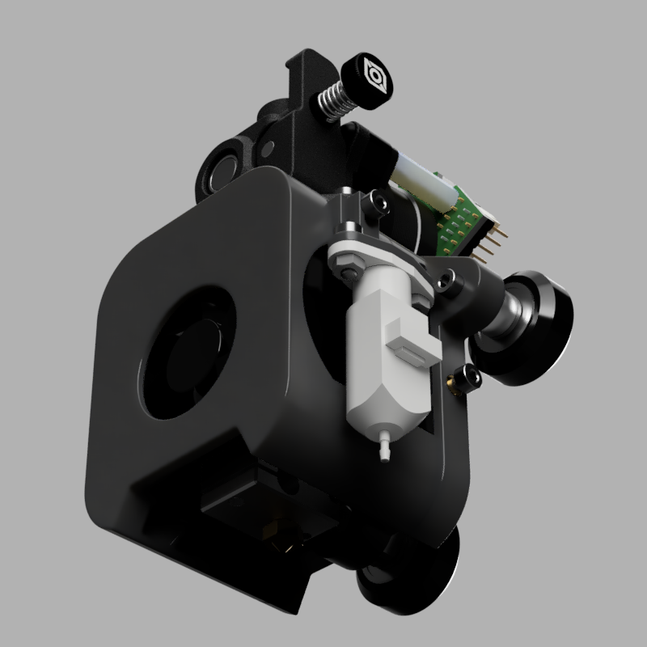

# Welder

A reimplementation of the [DragonBurner](https://github.com/chirpy2605/voron/tree/main/V0/Dragon_Burner) toolhead. It is designed to replace the stock extruder and hotend on Creality Ender 5 and Sovol SV05 series of 3D printers, or really, any printers that use V-WHeels on 2020 aluminum extrusions.

## Information

* For V-Wheels running on 2020 extrustion
* E3D V6 Hotend
* Orbiter v2 Extruder
* EBB36 CAN toolboard

You can easily extend the design to accomodate other extruders, hotends, probes, and linear guides.

|  |  |
| --- | --- |
|  |  |
|  |  |
|  | |
